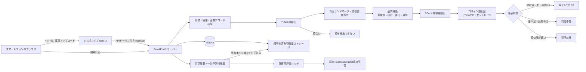

# TwinLens 技術提案書

- 作成日: 2026-07-18
- 対象: 家庭内利用から始める、双子の顔識別Webアプリ
- 前提: 本番精度は実際の双子の写真で検証するまで確定できない

## 1. 結論

最初に実装すべき方式は、**学習済み顔モデルで顔検出・位置合わせ・埋め込み抽出を行い、双子A/Bそれぞれの複数参照埋め込みとの類似度を比較し、絶対閾値・1位と2位の差・画像品質を同時に満たした場合だけ人物名を返す方式**である。

MVPの第一候補は次の構成とする。

- 顔検出・5点ランドマーク: OpenCV YuNet
- 顔位置合わせ・埋め込み: OpenCV SFace
- 推論: OpenCV DNN、CPU
- 類似度: 正規化埋め込みのコサイン類似度
- 集約: 上位k近傍平均と人物セントロイドの加重平均
- 拒否判定: 低品質、低検出信頼度、絶対類似度不足、A/B差不足を「判定不能」または「双子以外」にする

この方式は、20〜100枚/人という少量データで追加学習せず開始でき、CPUで動作し、誤判定を避ける拒否閾値を明示的に制御できる。実データで失敗原因を観測してから追加学習へ進める点も重要である。

ただし、一般的な顔埋め込みモデルは一卵性双生児の個体識別を保証しない。幼児期の成長、低解像度、横顔、同じ髪型や表情によりA/Bの分布が強く重なる可能性がある。その場合は閾値を緩めず、判定不能率を許容し、フェーズ3で双子専用Metric Learningを検討する。

## 2. 推奨システム構成



MVPではブラウザ内推論を採用しない。モデル配布、端末差、ブラウザメモリ、モデル抽出リスク、アップデート管理が増えるためである。写真は同一ホストのローカルAPIへ送信し、処理後に破棄する。

## 3. OSS選定表

| OSS | 用途 | 精度・適性 | CPU | 導入難易度 | 保守性 | ライセンス/商用注意 | 判断 |
|---|---|---|---|---|---|---|---|
| OpenCV YuNet | 顔検出、5点ランドマーク | 軽量。極小顔や強い遮蔽は弱点 | 良好 | 低 | 高 | YuNetディレクトリはMIT、OpenCVはApache-2.0。公開前にモデル単位で再確認 | **採用** |
| OpenCV SFace | 位置合わせ、顔埋め込み | 一般顔認識として有力。双子専用精度は要実証 | 良好 | 低 | 高 | OpenCV Zooのモデル固有条件を公開前に再確認 | **採用** |
| InsightFace SCRFD/ArcFace | 検出・高性能埋め込み | 精度候補として強い | ONNXで可 | 中 | 高 | コードはMITだが公式配布済み学習モデルは非商用研究用途と明記。別途ライセンスが必要 | 家庭内比較候補。本MVP既定からは不採用 |
| DeepFace | 複数モデルの統一ラッパー | 比較実験に便利 | モデル依存 | 低〜中 | 中 | 本体MIT。内包・取得する各モデルのライセンスを継承 | 実験用。本体には不採用 |
| facenet-pytorch | MTCNN、FaceNet埋め込み | 研究・比較が容易 | 可、OpenCVより重め | 中 | 中 | コードMIT。事前学習重みと元データの条件は別確認 | 比較ベースライン候補 |
| MediaPipe | 顔・ランドマーク | モバイル/ブラウザ適性 | 良好 | 中 | 高 | Apache-2.0。モデル条件も確認 | ブラウザ内推論時の代替 |
| ONNX Runtime | ONNX推論 | CPU/GPU最適化に有効 | 良好 | 中 | 高 | MIT | フェーズ2以降の候補 |
| FAISS | 大規模近傍探索 | 数万〜億件向け | 良好 | 中 | 高 | MIT | A/B各100件には過剰 |
| pgvector | PostgreSQLベクトル検索 | 多家族・大規模化向け | 良好 | 中 | 高 | PostgreSQL License | 一般公開時の候補 |
| SQLite | メタデータ・特徴量保存 | 1家庭・単一プロセスに十分 | 良好 | 低 | 高 | Public Domain | **採用** |
| FastAPI | API・静的UI配信 | 型定義、OpenAPI、実装速度 | 良好 | 低 | 高 | MIT | **採用** |

### ライセンス確認先

- OpenCV: https://github.com/opencv/opencv
- OpenCV Zoo: https://github.com/opencv/opencv_zoo
- YuNet: https://github.com/opencv/opencv_zoo/tree/main/models/face_detection_yunet
- SFace: https://github.com/opencv/opencv_zoo/tree/main/models/face_recognition_sface
- InsightFace: https://github.com/deepinsight/insightface#license
- DeepFace: https://github.com/serengil/deepface#license
- facenet-pytorch: https://github.com/timesler/facenet-pytorch
- ONNX Runtime: https://github.com/microsoft/onnxruntime

ライセンスは「ライブラリ本体」「学習済み重み」「学習データ」を分けて確認する。MITのラッパーを利用しても、取得される重みが商用利用可能になるわけではない。

## 4. 判定アルゴリズム

### 4.1 前処理

1. MIME、容量、画像デコードを検証する。
2. YuNetで全顔を検出する。
3. 検出信頼度が低すぎる顔を候補外にする。
4. 5点ランドマークでSFace入力へ位置合わせする。
5. ぼけ、顔面積、露出、簡易姿勢を0〜1へ正規化し品質値 `q` を算出する。
6. SFace埋め込み `x` をL2正規化する。

### 4.2 人物ごとの類似度

人物 `c ∈ {A, B}` の登録埋め込み集合を `E_c` とする。

```text
nearest_c = mean(top_k({ cosine(x, e) | e in E_c }))
centroid_c = cosine(x, normalize(mean(E_c)))
score_c = 0.7 * nearest_c + 0.3 * centroid_c
```

上位k平均は問い合わせ写真に近い登録例を重視する。セントロイドは偶然1枚だけに近い場合の過適合を抑える。MVPの `k=5` は仮置きで、検証データから選定する。

### 4.3 拒否を含む判定

```python
best = max(score_a, score_b)
second = min(score_a, score_b)
margin = best - second

if refs_a < N_min or refs_b < N_min:
    return "判定不能: 登録不足"
if detection_confidence < T_detect:
    return "判定不能: 検出信頼度不足"
if quality < T_quality:
    return "判定不能: 画像品質不足"
if best < T_other:
    return "双子以外、または顔を検出できない"
if best < T_accept:
    return "判定不能: 絶対類似度不足"
if margin < T_margin:
    return "判定不能: A/Bの差不足"
return argmax(score_a, score_b)
```

初期値は `T_detect=0.85`、`T_quality=0.35`、`T_other=0.28`、`T_accept=0.42`、`T_margin=0.08`。これは一般ベンチマークの保証値ではなく、安全側で開始するための**仮説値**である。実データのROC、FAR、双子間誤認率から再設定する。

「最も近い人物」を必ず返す設計は禁止する。AをBと誤表示するコストを、判定不能にするコストより高く設定する。

## 5. 学習・登録フロー

### 初回登録

- 最低: 各10枚。ただし閾値調整には不足しやすい。
- 推奨: 各30〜50枚。
- 上限目安: 各100枚。似た連写を増やすだけでは効果が小さい。
- 条件: 正面、左右30〜60度、笑顔、無表情、泣き顔、屋内外、明暗、眼鏡、帽子、異なる髪型、複数時期を含める。
- 1枚に登録対象以外の顔を含めない。MVPは登録時に顔がちょうど1つの画像だけ受理する。
- 顔が小さい、強いブレ、強い逆光、極端な遮蔽、加工アプリ、同じ写真の再保存は除外する。

### データ分割

- train/reference: 60%
- validation/threshold tuning: 20%
- test/final evaluation: 20%

連写、Live Photos由来、同一動画フレーム、同一撮影セッションは必ず同じグループに入れる。ランダムな画像単位分割では、ほぼ同じ写真がtrainとtestに混ざり、精度を過大評価する。

推奨グループキーは `撮影日 + 連写バースト + 場所/服装`。EXIFを保存しない運用では、登録前にセッション単位で分けるか、知覚ハッシュで近似重複をクラスタ化する。

### データ拡張

- 小さな明るさ・コントラスト変化
- 軽いJPEG圧縮
- 数度の回転
- 小さなクロップ
- 左右反転は、左右非対称の局所特徴を使う場合は慎重に扱う

顔形状を変える強い変形、生成AIで作った顔、過度なぼかしは使用しない。データ拡張は新しい本人情報を生成せず、撮影揺らぎへの耐性を増やすだけである。

### 成長への対応

- 月齢が低いほど、古い写真だけで現在を判定しない。
- 各人物に最近の時期の参照を一定数確保する。
- 新しい正解写真を追加し、古い埋め込みを完全削除せず時期別評価を行う。
- 将来は年代/時期クラスタごとのプロトタイプを持つ。
- モデル再学習より先に、参照集合と閾値を更新する。

### 訂正の反映

MVPでは判定後の顔埋め込みを暗号化して30日間保持し、家族がA/Bへ訂正した場合、品質条件を満たすものだけ参照集合へ追加できる。無条件自動学習は誤ラベルを増幅するため行わない。

一般公開時は、訂正を即時に本番参照へ入れず、レビュー待ちキュー、重複検出、外れ値検査、ロールバック可能なモデル/参照バージョンを導入する。

## 6. 精度評価方法

一般Accuracyだけでは、判定不能を増やして安全性を上げた効果やA/B取り違えの危険性を表せない。以下を別々に測る。

- `A→B誤認率 = A画像をBと確定した数 / A画像総数`
- `B→A誤認率 = B画像をAと確定した数 / B画像総数`
- `判定不能率 = 判定不能数 / 全問い合わせ数`
- `未登録人物誤受入率 = 双子以外をAまたはBと確定した数 / 未登録人物数`
- FAR: impostor比較が受理閾値を超える割合
- FRR: genuine比較が受理されない割合
- Coverage: A/Bを確定できた割合
- Conditional accuracy: A/Bを確定したケースに限定した正解率

評価データには次を含める。

1. 双子A/Bの別日、別服装、別表情、別角度、別端末、低照度写真。
2. 両親、兄弟姉妹、親族など顔が似た未登録人物。
3. 同じ写真に複数人がいるケース。
4. 顔なし、後頭部、ぬいぐるみ、テレビ画面、印刷写真。
5. 登録時より数か月後の写真。
6. 画面キャプチャ、SNS再圧縮、低解像度画像。

閾値探索では `T_accept` と `T_margin` の2次元グリッドを評価し、次の制約内でCoverageを最大化する。

```text
A→B誤認率 <= 許容上限
B→A誤認率 <= 許容上限
未登録人物誤受入率 <= 許容上限
```

家庭内MVPでは、まず双子間誤認0件を目標にし、その代わり判定不能率が高くなることを許容する。ただし有限テスト集合内で0件でも、将来の誤認がゼロという保証ではない。

## 7. MVP実装計画

### 1〜2週間で含める機能

- A/Bそれぞれ複数画像の登録
- JPEG/PNG/WebP入力
- 1枚内の複数顔検出
- A/B/判定不能/双子以外・顔なしの表示
- 類似度、差、品質、拒否理由の表示
- ユーザー訂正
- 品質を満たす訂正埋め込みの参照追加
- 登録数と閾値表示
- 全データ削除API
- APIトークン
- 特徴量のFernet暗号化
- Docker Compose起動
- 判定ロジック単体テスト、CI

### MVPで実装しない機能

- 双子専用モデルの追加学習
- 自動閾値最適化UI
- ブラウザ内推論
- 多家族テナント
- 本格的なユーザー/権限管理
- クラウドオブジェクトストレージ
- FAISS/pgvector
- 監査ログ外部転送
- 顔の局所特徴アンサンブル
- 年齢推定、感情推定、性別推定

### ディレクトリ構成

```text
TwinLens/
├── app/
│   ├── config.py
│   ├── database.py
│   ├── decision.py
│   ├── face_engine.py
│   ├── main.py
│   ├── security.py
│   └── static/index.html
├── docs/TECHNICAL_PROPOSAL.md
├── scripts/generate_env.py
├── tests/test_decision.py
├── Dockerfile
├── docker-compose.yml
├── requirements.txt
└── .github/workflows/ci.yml
```

### API一覧

| Method | Path | 用途 |
|---|---|---|
| GET | `/api/v1/health` | ヘルスチェック。認証不要 |
| GET | `/api/v1/stats` | A/B登録数と閾値 |
| POST | `/api/v1/enroll/{A|B}` | 複数写真から参照埋め込み登録 |
| POST | `/api/v1/identify` | 1枚の全顔を判定 |
| POST | `/api/v1/corrections` | 判定訂正、任意で参照へ追加 |
| DELETE | `/api/v1/data` | 家庭内データ全削除 |

### DB設計

- `embeddings`: subject、暗号化特徴量、品質、検出信頼度、元画像SHA-256、由来、作成日時、active。
- `predictions`: UUID、暗号化特徴量、予測、A/Bスコア、品質、訂正、作成日時。保持期限あり。
- `audit_events`: 訂正などの最小イベント。画像、ファイル名、顔画像は保存しない。

### 実装順序

1. Docker、モデル取得、ヘルスチェック。
2. 顔検出・位置合わせ・埋め込み抽出。
3. 登録と暗号化保存。
4. 類似度集約と拒否判定。
5. 複数顔UI。
6. 訂正フロー。
7. 実データ評価、閾値調整。
8. セキュリティ確認とバックアップ手順。

### テスト方針

- 単体: 絶対閾値、マージン、低品質、未登録、登録不足。
- 統合: モデルを含むDocker起動、登録、判定、訂正、削除。
- セキュリティ: 無認証、過大ファイル、不正画像、MIME偽装、SQL破壊入力。
- 評価: セッション分離済みの実写真でROC/FAR/FRR/双子間誤認率。
- 回帰: 閾値やモデル変更時に固定評価セットを再実行。

## 8. 推奨技術スタック

| 層 | 選定 | 理由 |
|---|---|---|
| フロント | HTML/CSS/Vanilla JS | 画面数が少なく、ビルド基盤不要 |
| バックエンド | Python 3.12 + FastAPI | ML周辺と親和性が高く、一人で保守しやすい |
| 顔検出 | OpenCV YuNet | CPU向け軽量、ランドマーク同時取得 |
| 埋め込み | OpenCV SFace | OpenCV内で位置合わせから特徴量まで完結 |
| 類似度 | NumPy | データ量が小さくベクトルDB不要 |
| DB/ストレージ | SQLite + 暗号化BLOB | 単一家庭MVPに十分、元画像不要 |
| 認証 | 長い共有APIトークン | 家庭内MVPの最小構成。公開時はOIDCへ移行 |
| 暗号化 | Fernet + OS/ボリューム暗号化 | 特徴量漏えい対策。鍵はDB外管理 |
| コンテナ | Docker Compose | ローカル再現性と移行性 |
| テスト | pytest + GitHub Actions | 判定ロジックとDockerビルドを継続確認 |

### 推論場所の比較

| 方式 | プライバシー | 性能/互換性 | 更新 | 推奨 |
|---|---|---|---|---|
| ブラウザ内 | 写真が端末外へ出ない | 端末差、モデルサイズ、WebGPU対応差 | 難しい | 将来候補 |
| 家庭内ローカルサーバー | 家庭LAN内のみ | CPUを統一できる | 容易 | **MVP推奨** |
| クラウド | 遠隔利用しやすい | 転送・保管・法務リスク増 | 容易 | 一般公開時に要再設計 |

CPUはGPUより遅いが、家庭内の単発写真処理では先に実測すべきである。GPUは大量同時処理や追加学習時に有効であり、MVPの必須条件ではない。

## 9. 段階的な改善案

| フェーズ | 内容 | 期待 | 必要データ | 難易度 | 計算コスト |
|---|---|---|---|---|---|
| 1 | 学習済みモデル＋距離判定＋拒否 | 実現可能性と分布重なりを確認。精度値は未確定 | 各20〜50枚＋独立テスト | 低 | CPU低 |
| 2 | 訂正、時期別参照、閾値最適化、品質改善 | 誤認を増やさずCoverage改善が期待 | 各50〜200枚、未登録人物、訂正履歴 | 中 | CPU低〜中 |
| 3 | Siamese/Triplet/Contrastive、局所特徴、アンサンブル | 一般埋め込みで分離できない場合に改善余地 | 各人物数百枚相当の多様なペア | 高 | 学習GPU推奨、推論CPU可 |

### フェーズ3の優先順

1. 既存埋め込みを固定し、小さな分類器/metric headだけ学習する。
2. Hard negativeとして双子A/Bの似た条件の画像を選ぶ。
3. 時期クラスタや局所cropの埋め込みを追加する。
4. 最後にbackboneの後段のみを低学習率で微調整する。

20〜100枚/人でbackbone全体をファインチューニングすると、撮影条件や服装を記憶する過学習が起きやすい。まず固定埋め込みの分離可能性を測定する。

## 10. リスクと限界

### 確認済み事項

- 顔埋め込みと距離比較は少量登録で開始できる。
- OpenCV YuNet/SFaceはCPU推論可能である。
- InsightFaceの公式配布モデルは、コードのMITライセンスとは別に非商用研究用途の制限が明記されている。
- 日本の個人情報保護委員会は、本人認証可能な顔特徴量を個人識別符号になり得るものとして説明している。
- 暗号化しても、識別に使える特徴量が個人情報でなくなるとは限らない。

### 実証が必要な事項

- 対象の双子をSFace埋め込みで十分に分離できるか。
- 月齢・成長により必要な参照更新頻度。
- 横顔、泣き顔、帽子、低照度での品質閾値。
- `T_other`、`T_accept`、`T_margin` の適切な値。
- 家庭の一般PCでの1枚あたり処理時間。
- 局所特徴やSiamese Networkが実際に改善するか。

### 主な技術リスク

1. **双子間の埋め込み分布が重なる**: 閾値を緩めるとA/B誤認が増える。判定不能を受け入れる。
2. **幼児の成長**: 古い参照が急速に陳腐化する可能性。時期別参照と定期再評価が必要。
3. **撮影条件への依存**: 髪型、帽子、服、背景を間接的に利用し、条件が変わると崩れる可能性。
4. **訂正汚染**: 誤訂正を自動登録すると誤りが自己強化する。品質・外れ値・レビュー条件を設ける。
5. **特徴量漏えい**: 元画像を保存しなくても、埋め込みは照合可能な生体テンプレートである。暗号化、鍵分離、アクセス制御、削除を行う。
6. **モデル供給網**: Docker build時の外部モデル取得は改ざん・更新リスクがある。本番ではモデルを不変リビジョンとSHA-256に固定する。
7. **OSSライセンス変更**: 更新時にモデル規約が変わる可能性。バージョンごとに証跡を残す。

### 法的・倫理的注意

日本で一般公開する場合、顔画像および本人を識別できる顔特徴量は個人情報・個人識別符号として扱う前提で設計する。家庭内だけでも、保護者間で目的、保存期間、削除方法、第三者提供禁止を合意する。一般公開時は少なくとも次を実施する。

- 利用目的を顔識別に限定し、年齢・感情などへ目的外利用しない。
- 保護者同意だけで十分か、対象地域の児童データ規制を法務確認する。
- 収集最小化、保存期限、削除・エクスポート、漏えい対応手順を定める。
- 顔特徴量を広告、スコアリング、監視、第三者データ照合へ転用しない。
- 技術的精度と公平性を説明し、誤判定時に人間が訂正できるようにする。
- 公開前に個人情報保護影響評価、脅威モデリング、第三者セキュリティレビューを行う。

参考:

- https://www.ppc.go.jp/personalinfo/legal/guidelines_tsusoku/
- https://www.ppc.go.jp/all_faq_index/faq1-q1-22

### まず何を検証するか

1. 各双子について、撮影セッションを分離した参照30枚・検証20枚・テスト20枚を用意する。
2. 両親・姉妹・親族を含む未登録人物を最低50顔用意する。
3. 現MVPで全組を推論し、A→B、B→A、未登録誤受入、判定不能率を集計する。
4. 双子間誤認を許容上限以下に保ったまま、`T_accept` と `T_margin` を調整する。
5. Coverageが実用水準に届かない場合だけ、別埋め込みモデル比較、時期別プロトタイプ、局所特徴、Metric Learningの順で追加する。

この検証前に「双子を高精度で見分けられる」と断定してはならない。
