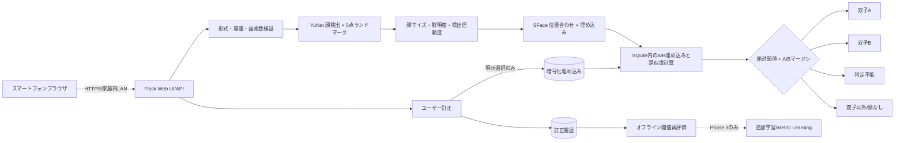

# TwinLens 技術提案書

確認日: 2026-07-18  
方針: Ponytail `full`。必要な精度検証を削らず、MVPに不要な技術は導入しない。

## 1. 結論

最初に実装すべき方式は、**学習済み顔検出・顔認識モデルから埋め込みを抽出し、双子A/Bの登録埋め込みとのコサイン類似度を比較し、絶対閾値とA/B間マージンで拒否する方式**である。

MVPは以下に限定する。

- 顔検出・5点位置合わせ: OpenCV YuNet
- 顔埋め込み: OpenCV SFace
- 検索: NumPyによる線形比較
- 保存: 暗号化した埋め込みをSQLiteへ保存、元画像は保存しない
- 改善: ユーザー訂正を記録し、明示的に選択された高品質データだけ参照へ追加

理由は、20〜100枚/人の少量データで追加学習から始めると過学習とデータリークの影響が大きく、双子専用モデルの優位性を評価できないためである。まず固定埋め込みで「対象の双子が分離可能か」を実測し、分離できない場合だけMetric Learningへ進む。

一般的な顔認識ベンチマークの高精度は、対象の双子の識別精度を保証しない。本番精度は実写真でのみ確認できる。

## 2. 推奨システム構成



画像はメモリ内で処理し、保存しない。埋め込みも顔認証に使える生体情報として扱い、アプリケーション鍵で暗号化する。

## 3. OSS選定表

### 方式比較

| 方式 | 少量データ | 双子への期待 | 実装/運用コスト | MVP判断 |
|---|---|---|---|---|
| 学習済み埋め込み＋距離 | 最も適する | 対象次第。最初に検証可能 | 低 | 採用 |
| ArcFace/FaceNetの全体fine-tune | 過学習しやすい | データが十分なら改善余地 | 高 | 初期不採用 |
| A/B画像分類 | 背景・服・髪を学習しやすい | 顔以外のリークが大きい | 中 | 不採用 |
| Siamese/Triplet/Contrastive | hard pairが十分なら有望 | 双子間差分を直接学習可能 | 高 | Phase 3候補 |
| 目・耳・輪郭等の局所特徴 | 撮影条件に敏感 | 補助情報として有望 | 高 | データ分析後 |
| アンサンブル | 各方式の失敗が異なる時に有効 | 改善可能性あり | 非常に高 | 測定根拠が出るまで不採用 |

### コンポーネント比較

| 機能 | 第一候補 | 代替 | CPU | 導入 | ライセンス/商用注意 | 判断 |
|---|---|---|---|---|---|---|
| 顔検出・5点位置合わせ | YuNet | MediaPipe、RetinaFace | 良好 | 低 | YuNetディレクトリはMIT | 軽量でSFaceと直接連携 |
| 埋め込み | SFace | FaceNet、ArcFace系 | 良好 | 低 | SFaceディレクトリはApache-2.0 | OpenCVだけで推論可能 |
| 統合ライブラリ | OpenCV | DeepFace | 良好 | 低 | OpenCV Apache-2.0 | 依存と挙動を最小化 |
| API/UI | Flask + native HTML/JS | FastAPI + React | 良好 | 低 | Flask BSD-3-Clause | 1サービスで十分 |
| 類似検索 | NumPy | FAISS、pgvector | 良好 | 最低 | NumPy BSD | 数百件に索引は不要 |
| DB | SQLite | PostgreSQL/pgvector | 良好 | 最低 | Public Domain | 家庭内単一プロセスに十分 |
| 暗号化 | cryptography/Fernet | OS暗号化のみ、KMS | 良好 | 低 | Apache-2.0/BSD | 埋め込み保護に必要 |

DeepFace本体はMITだが、ラップする各モデルのライセンスを継承するため、採用モデルごとの確認が必要。InsightFaceはコードがMITでも公式配布学習済みモデルが原則非商用研究用途で、2025-11-24更新では商用ライセンス窓口が案内されているため、一般公開を想定する既定MVPには採用しない。

公式確認先:

- YuNet: https://github.com/opencv/opencv_zoo/tree/main/models/face_detection_yunet
- SFace: https://github.com/opencv/opencv_zoo/tree/main/models/face_recognition_sface
- InsightFace license: https://github.com/deepinsight/insightface#license
- DeepFace license note: https://github.com/serengil/deepface#licence

## 4. 判定アルゴリズム

### 処理手順

1. アップロード容量、画像デコード、最大画素数を検証する。
2. YuNetで全顔と5点ランドマークを検出する。
3. 各顔について検出信頼度、顔領域、Laplacian varianceによる鮮明度を計算する。
4. SFaceで位置合わせし、L2正規化埋め込み `x` を得る。
5. A/Bそれぞれの参照埋め込みとのコサイン類似度を計算する。
6. 各人物の上位3件の平均を人物スコアにする。
7. 絶対スコア、1位と2位の差、品質を満たす時だけA/Bを返す。

参照埋め込み集合を `E_A`, `E_B` とする。

```text
cos(x, e) = x · e                      # x, e はL2正規化済み
score(P) = mean(top_k(cos(x, e), e∈E_P)), k=min(3, |E_P|)
best = max(score(A), score(B))
margin = |score(A) - score(B)|
```

判定規則:

```text
検出信頼度 < d_min または 品質 < q_min:
    判定不能
best < t_other:
    双子以外
best < t_accept または margin < t_margin:
    判定不能
それ以外:
    bestの人物
```

初期値は `d_min=0.80`, `q_min=25`, `t_other=0.25`, `t_accept=0.48`, `t_margin=0.06`。これらは安全側の仮値であり、実データで較正する。顔サイズが小さい場合、品質値だけでなく最小幅・高さを追加する余地がある。

「最も近い人物」を常に返さない。A/B誤認は家庭内用途でも心理的影響があり、判定不能率を許容して誤認率を優先的に下げる。

## 5. 学習・登録フロー

### 初回登録

- 各人20枚から開始し、可能なら40〜60枚へ増やす。
- 日、場所、服、表情、撮影者、端末を分散する。
- 正面だけでなく軽い左右角度、笑顔、泣き顔を含める。
- 強いぼけ、極端な遮蔽、顔が小さい画像、複数人画像は登録から除外する。
- 帽子・眼鏡は実運用頻度に応じて含めるが、それだけに偏らせない。

登録画像は顔が1つだけのものに限定し、ラベル取り違えを防ぐ。判定画像は複数顔に対応する。

### 分割とリーク防止

ランダムな画像単位ではなく、**撮影セッション単位**で分割する。

- 登録/学習: 60%
- 閾値調整: 20%
- 最終テスト: 20%

同一連写、同一動画、数秒以内の類似写真は同じグループに固定する。兄弟の同一集合写真から切り出したA/B顔も同じ分割へ置く。重複に近い画像が分割を跨ぐと、実運用より過大な精度になる。

### データ拡張

Phase 1では原則として行わない。埋め込みモデルは固定であり、同一画像を人工的に増やして参照集合を膨らませても情報量は増えない。Phase 3で追加学習する場合だけ、軽い左右反転、色・明るさ、圧縮、わずかな回転・クロップを用いる。顔形状を変える強い変形は避ける。

### 成長と再登録

幼児は顔の変化が大きいため、撮影日時を保持し、数か月ごとに新しい高品質写真を追加する。古い写真を即削除せず、時期別評価で古い参照が誤判定を増やす場合だけ除外する。モデル再学習より先に、直近参照への重み付けまたは時期別セントロイドを検討する。

### 訂正の反映

訂正は履歴へ保存する。参照追加はユーザーが明示的にチェックしたA/B写真だけに限定する。自動追加すると誤予測が自己強化されるため禁止する。

## 6. 精度評価方法

評価単位は画像全体ではなく顔単位とし、同じ写真内の顔を独立に数えつつ、写真IDを保持する。

必須指標:

- `A→B率 = AをBとした数 / 真のA数`
- `B→A率 = BをAとした数 / 真のB数`
- 判定不能率
- 未登録人物誤受入率
- FAR: 異人物比較を同一人物として受け入れる率
- FRR: 同一人物比較を拒否する率
- ROC/DET曲線
- `t_accept` と `t_margin` の組合せ別混同行列

評価データには以下を含める。

- 各双子の過去と現在の写真
- 同じ服、別の服、髪型変化
- 正面、横向き、笑顔、泣き顔、低照度
- 親、兄弟、親戚など顔が似た未登録人物
- 小さい顔、複数人、部分遮蔽

運用目標はAccuracy最大化ではなく、A/B相互誤認に重いコストを設定する。例として、A/B誤認1件を判定不能10件より重く扱い、閾値を決める。具体的な許容値は家族が決定する。

## 7. MVP実装計画

### MVPに含める

- A/Bの複数写真登録
- 複数顔の検出と判定
- 4分類
- 訂正履歴と任意の参照追加
- 暗号化埋め込み、画像非保存
- APIトークン、容量・画素数検証
- スマートフォン対応UI
- Docker Compose
- 判定ロジックの最小テスト

### MVPに含めない

- 独自モデル学習
- FAISS/pgvector
- React、ORM、Redis、ジョブキュー
- 自動再学習、モデルレジストリ
- 複数家庭/複数ユーザー
- 公開インターネット向けTLS、監査基盤、鍵管理サービス
- 活体検知

### ディレクトリ

```text
.
├── app.py
├── decision.py
├── static/index.html
├── tests/test_decision.py
├── docs/TECHNICAL_PROPOSAL.md
├── Dockerfile
├── docker-compose.yml
├── requirements.txt
└── AGENTS.md
```

### DB

- `embeddings`: person, 暗号化vector, source, created_at
- `predictions`: 暗号化vector, predicted, A/B score, quality, corrected, created_at

### 実装順序

1. 判定規則とテスト
2. 顔検出・埋め込み
3. 登録・判定API
4. 訂正・暗号化保存
5. native HTML UI
6. Docker/CI
7. 実写真による閾値評価

## 8. 推奨技術スタック

| 領域 | 採用 |
|---|---|
| フロント | HTML/CSS/JavaScript、ブラウザnative file input |
| バックエンド | Python 3.12 + Flask |
| 推論 | OpenCV DNN、YuNet、SFace |
| 数値処理 | NumPy |
| DB/ストレージ | SQLite、Docker volume |
| 暗号化 | cryptography Fernet |
| 認証 | ローカル用固定APIトークン |
| コンテナ | Docker Compose、non-root、read-only、cap drop |
| テスト | Python unittest 1ファイル |

CPUで十分に検証可能。GPUは大量画像のバッチ処理や追加学習でのみ有益で、1枚ずつの家庭内推論には初期必須ではない。

推論場所の比較:

| 場所 | 利点 | 欠点 | 判断 |
|---|---|---|---|
| ブラウザ内 | 写真が端末外へ出ない | モデル配布、端末差、実装負荷 | 将来候補 |
| 家庭内ローカルサーバー | 実装が単純、データ統制可能 | PC起動が必要 | MVP採用 |
| クラウド | 共有と可用性 | 未成年の生体情報、運用・法務・費用 | 初期不採用 |

## 9. 段階的な改善案

| Phase | 内容 | 必要データ | 期待 | 難易度/計算 |
|---|---|---:|---|---|
| 1 | 固定埋め込み＋距離＋拒否 | 20〜60枚/人 | 分離可能性を測る基準。精度値は実測まで不明 | 低/CPU |
| 2 | 訂正、撮影時期管理、閾値最適化 | 追加の独立評価顔100件程度以上が望ましい | A/B誤認と判定不能のトレードオフ改善 | 中/CPU |
| 3 | Siamese/Tripletまたはadapter fine-tune | 多様な時期・条件、hard positive/negativeが必要 | 固定埋め込みで重なる場合に改善余地。保証なし | 高/GPU推奨 |

Phase 3へ進む条件:

- データリークを除いたテストでA/Bスコア分布が大きく重なる。
- 閾値を厳しくすると判定不能が実用不能な水準になる。
- 誤りが品質や検出ではなく、埋め込みの分離不足に起因する。
- 独立した検証・テストセットを残せるだけのデータがある。

局所特徴やアンサンブルは、エラー分析で「耳が見える時だけ改善する」など再現可能な根拠が出た場合だけ追加する。

## 10. リスクと限界

### 確認済み

- YuNetとSFaceはCPU推論可能で、OpenCVから利用できる。
- YuNetディレクトリはMIT、SFaceディレクトリはApache-2.0と公式READMEに記載されている。
- InsightFaceの公式学習済みモデルには非商用研究用途の制約がある。
- 顔を照合可能な水準へ変換した符号は、日本の個人情報保護法上の個人識別符号に該当し得る。個人情報保護委員会FAQ: https://www.ppc.go.jp/all_faq_index/faq1-q1-22/

### 実証が必要

- SFace埋め込みが対象の双子を十分に分離できるか。
- 年齢変化で閾値や参照データがどの程度劣化するか。
- 必要な判定不能率とA/B誤認率のバランス。
- 横顔、泣き顔、帽子、眼鏡、小さい顔での実用性。
- 暗号化された埋め込みだけで家庭内のリスク許容水準を満たすか。

### セキュリティ・倫理

- 埋め込みから元画像を完全復元できないとしても、照合・属性推定・他データとの連結リスクがある。匿名情報とは扱わない。
- 親権者の管理下でも、利用目的、保存期間、削除方法、共有範囲を明示する。
- 公開サービス化する前に、同意、本人の成長後の意思、削除要求、漏えい対応、データ移転、地域法令を法務確認する。
- 固定トークンとFernet鍵は家庭内MVPの上限。公開時はユーザー認証、TLS、秘密管理、監査ログ、レート制限、バックアップ/削除手順が必要。
- 元画像非保存は漏えい影響を下げるが、誤登録の追跡や再評価が難しくなる。必要なら明示同意した評価セットだけ別領域に保存する。

## まず実装・検証すること

1. 各双子20枚以上を登録する。
2. 別撮影日の写真と似た家族を含む評価セットを作る。
3. A→B、B→A、未登録人物誤受入、判定不能を測る。
4. `accept` と `margin` を安全側に調整する。
5. 固定埋め込みの限界が確認された場合だけPhase 3を設計する。
